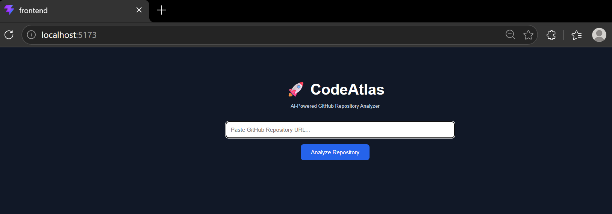
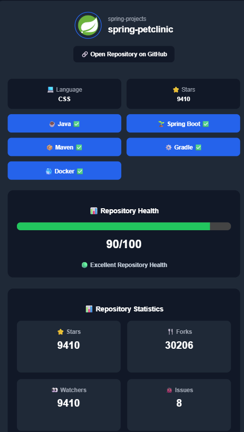
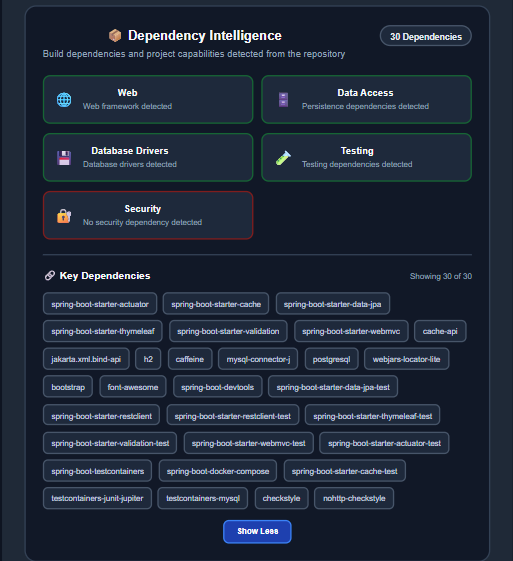
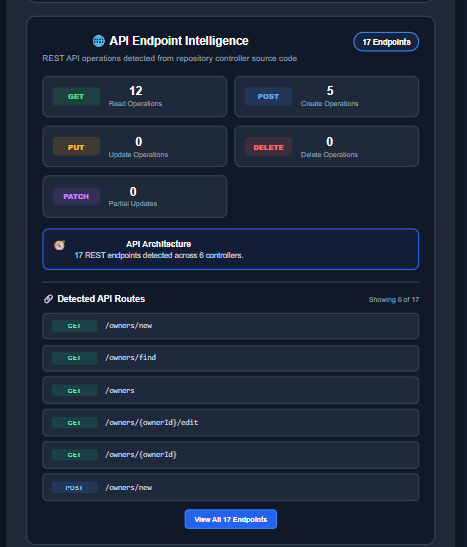
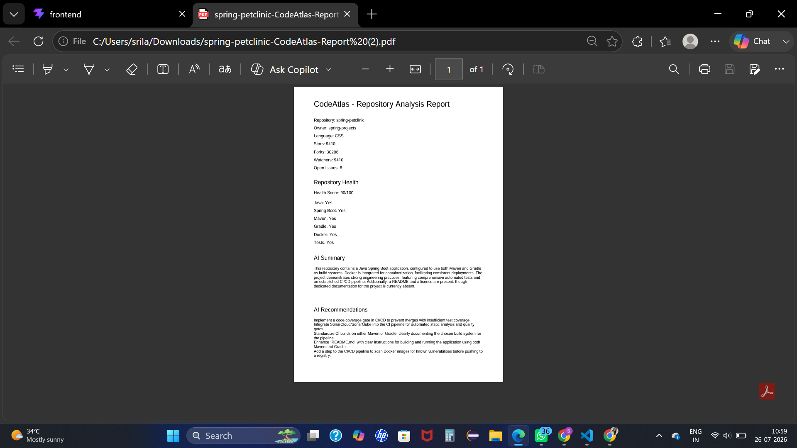

# 🚀 CodeAtlas

<div align="center">

### AI-Powered GitHub Repository Intelligence Platform

Analyze any public GitHub repository using AI and generate deep engineering insights, technology stack analysis, dependency intelligence, architecture detection, and downloadable reports.


</div>

---

# ✨ Features

✅ AI Repository Summary

✅ Repository Health Score

✅ Codebase Intelligence

✅ Technology Stack Detection

✅ Dependency Intelligence

✅ API Endpoint Intelligence

✅ Architecture Detection

✅ Spring Boot Detection

✅ Build Tool Detection (Maven / Gradle)

✅ Database Detection

✅ REST API Analysis

✅ PDF Report Generation

---

# 🏗️ Architecture

```
              GitHub Repository URL
                        │
                        ▼
                React Frontend
                        │
                        ▼
            Spring Boot Backend API
                        │
     ┌──────────────────┼───────────────────┐
     ▼                  ▼                   ▼
 GitHub REST API   Repository Scanner   Gemini AI
     │                  │                   │
     └──────────────────┼───────────────────┘
                        ▼
              Repository Intelligence
                        │
                        ▼
             Interactive Dashboard
                        │
                        ▼
                 PDF Report Export
```

---

# 📊 Repository Analysis Includes

- Repository Metadata
- Health Score
- AI Generated Summary
- AI Recommendations
- Technology Stack
- Dependency Analysis
- Build System
- Java Version
- Spring Boot Version
- Database Detection
- ORM Detection
- Testing Framework
- REST Endpoint Analysis
- Codebase Metrics
- Repository Strengths
- Areas for Improvement

---

# 🛠 Tech Stack

## Frontend

- React
- Axios
- CSS3

## Backend

- Java 21
- Spring Boot
- Maven
- REST APIs

## AI

- Google Gemini API

## External APIs

- GitHub REST API

---

# 📸 Screenshots

## Home Page

> 

---

## Repository Dashboard

> 

---

## Dependency Intelligence

> 

---

## API Endpoint Intelligence

> 

---

## PDF Report

> 

---

# 🚀 Getting Started

## Clone Repository

```bash
git clone https://github.com/Srilakshmi-Kota/CodeAtlas.git
```

Backend

```bash
cd backend
mvn spring-boot:run
```

Frontend

```bash
cd frontend
npm install
npm run dev
```

---

# 📈 Future Improvements

- Authentication
- Private Repository Support
- Multi-language Analysis
- Repository Comparison
- Docker Deployment
- Cloud Deployment

---

# 👩‍💻 Author

**Srilakshmi Saraswathi Kota**
Demo link:
https://code-atlas-sand.vercel.app/

GitHub:
https://github.com/Srilakshmi-Kota

LinkedIn:
https://www.linkedin.com/in/srilakshmi-saraswathi-kota-139ba4294

---

⭐ If you like this project, consider giving it a star.
